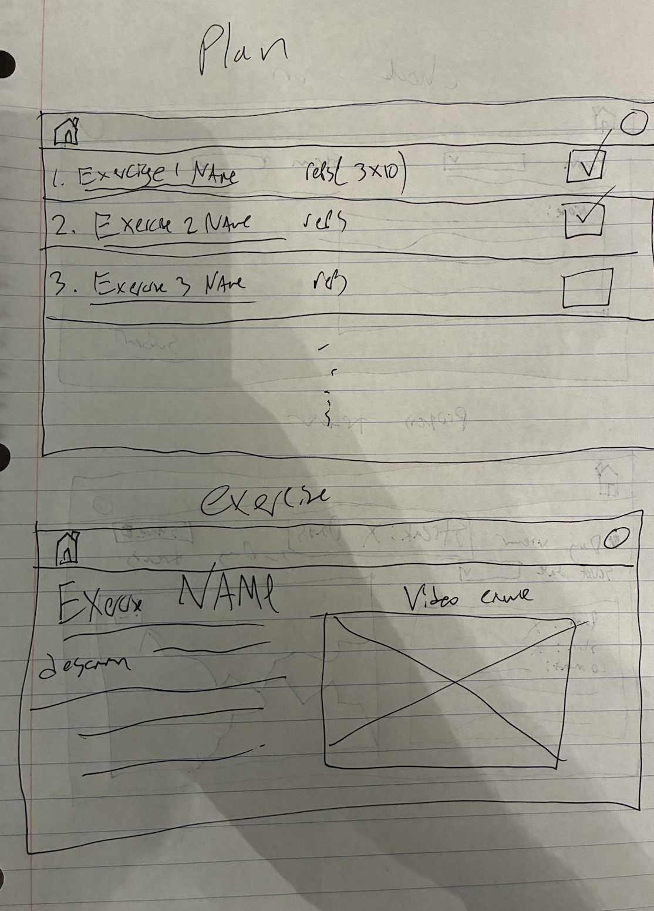
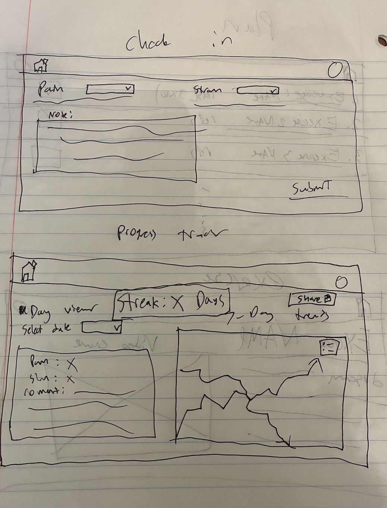
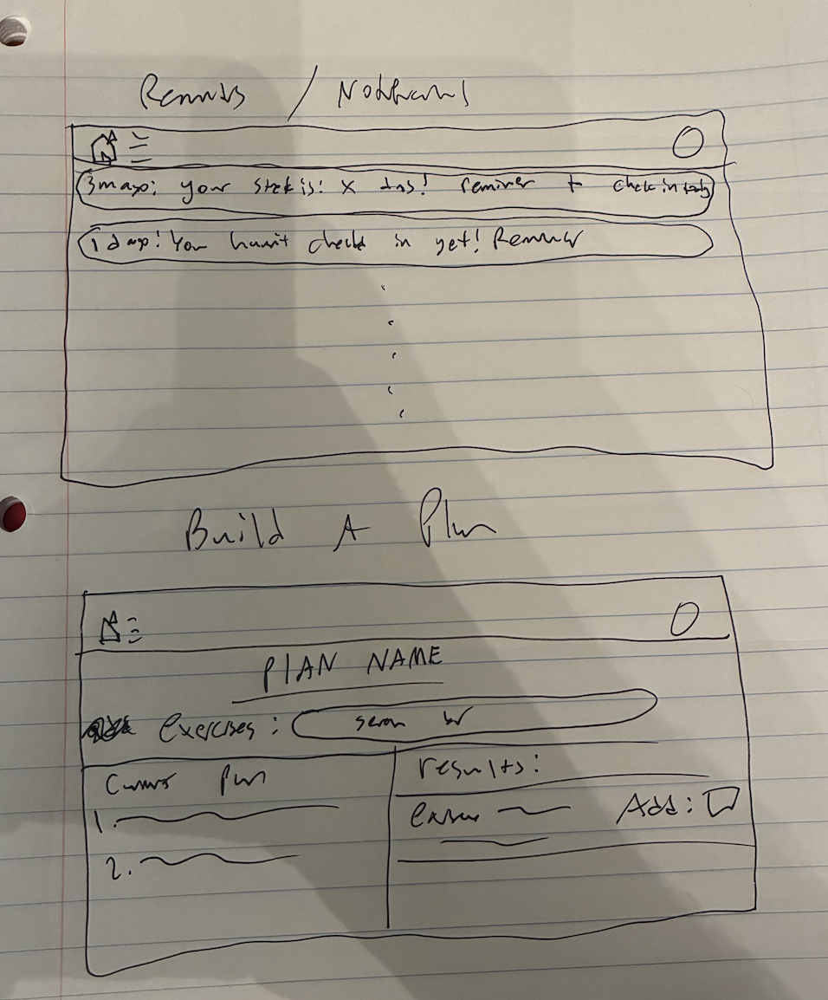

# Assignment 2 — Functional Design

## Problem Statement
**Domain: Injury Rehabilitation**

I tore my ACL a year ago and have dealt with persistent knee issues. There is a lot of work that goes into dealing with injury rehab, between going to physical therapy, doing at home exercises, and managing pain. 

**Problem:The Adherence & Feedback Gap in Home Exercise Programs.**

Recovering athletes spend far more hours training alone than in the clinic. Once formal PT sessions end, the burden shifts to the athlete; who must remember daily routines, judge progress, and stay motivated through slow gains.

Personal connection: After an ACL reconstruction, I found that doing the exercises was easy; remembering to do them every day was not. The lack of feedback between sessions made it hard to stay consistent or know if I was improving.

It can be difficult to keep track of all the prescribed exersizes as student athletes need to juggle classes, school work, doctor's visits, team activities, and PT appointments. Properly doing at home exersizes is a major hurdle in injury rehab.

**Stakeholders** 
- **Student athletes**: Must remember and correctly dose unsupervised home exercises while juggling school and team schedules, so gaps in day-to-day feedback lead to missed or inconsistent adherence.
 - **Physical therapists and athletic trainers**: Prescribe progressions but lack continuous visibility into what was actually completed between visits, forcing guesswork on load adjustments.
- **Coaches**: Set participation expectations without reliable visibility into rehab status, creating pressure–misalignment that can push premature workload.

**Evidence and Comparables**
* **Digital rehab improves adherence/outcomes**. Meta-analysis/RCTs show app-supported home exersize programs increase short-term adherence and functional gains. https://pubmed.ncbi.nlm.nih.gov/35960507/

* **Reminder systems help**. Lightweight prompts + symptom logging improve compliance with home exersize programs. (Review) — https://pmc.ncbi.nlm.nih.gov/articles/PMC5771354/

* **Adherence affects outcomes**. Consistent completion correlates with pain/function improvement, including knee rehab populations. — https://pmc.ncbi.nlm.nih.gov/articles/PMC11292889/

* **Non-adherence is common**. Forgetfulness, low motivation, and uncertainty drive home exersize program drop-off.  https://pmc.ncbi.nlm.nih.gov/articles/PMC5856927/

* **Digital support shows gains**. Simple self-monitoring and reminders increase early adherence. — https://www.archivesofphysiotherapy.com/index.php/aop/article/view/2802

* **At-home exercise lead to improvement in knee pain**. home exersize program adherence relates to symptom improvement in knee disorders. — https://bmcmusculoskeletdisord.biomedcentral.com/articles/10.1186/s12891-022-05959-6

* **Comparable: Physitrack/PhysiApp** validates demand; ReHabits differentiates with adaptive load guardrails and ultra-light sharing. — https://www.physitrack.com/physiapp-patient-experience

## Application Pitch

* **Name: OnTrack**
* **Motivation**: OnTrack keeps athletes consistent between sessions by combining reminders, check-ins, and visible progress into one daily feedback loop.
* **Key Features**

| Feature | What it does | Why it helps | Effect on Stakeholders |
|----------|---------------|---------------|---------------|
| **1. Smart Reminders** | Sends notifications based on missed logs or streaks. | Prevents forgetting and builds routine. | Athletes reduce missed days; PTs get steadier progress signals; coaches see steadier return timelines.|
| **2. Daily Check-in & Log** | Simple form to mark exercises done, rate effort/pain, and note comments. | Captures adherence without friction, helps track progress. | Athletes capture adherence with near-zero friction; PTs get better in-visit adjustments; coaches get safer ramp-ups.|
| **3. Feedback Dashboard** | Shows streaks, completion trends, and PT-style summaries (“You completed 6/7 days this week”). | Gives motivation through visible progress. | Athletes get motivation via streaks; PTs can review summaries via share links; coaches can view high-level readiness.|

## Concept Design

**Concept** User  
**Purpose** Represent an athlete’s identity, notification preferences, and read-only sharing  
**Principle** An athlete creates an account, sets a reminder time, and (optionally) creates share links so others can view summaries without modifying data  
**state**  
* a set of Users with
    * reminderTime TimeOfDay
    * shareLinks set of ShareLink
* a set of ShareLinks with
    * token String
    * expiry DateTime

**actions**  
* register () : (user: User)
    * **requires** n/a
    * **effects** creates a new user with default reminderTime and no shareLinks

* setReminderTime (user: User, time: TimeOfDay)
    * **requires** user exists
    * **effects** sets user.reminderTime := time

* createShareLink (user: User, ttlSeconds: Number) : (token: String)
    * **requires** user exists
    * **effects** creates a ShareLink with random token and expiry = now + ttlSeconds; adds it to user.shareLinks

* revokeShareLink (user: User, token: String)
    * **requires** a share link with token exists for user
    * **effects** removes that link from user.shareLinks

**Concept** ExerciseLibrary  
**Purpose** Provide a catalog of exercises that a plan is allowed to reference  
**Principle** Administrators populate a library of named exercises with media and cues; athletes can browse but cannot modify it  
**state**  
* a set of Exercises with
    * exerciseId String
    * title String
    * videoUrl String
    * cues String
    * recommendedFreq PerWeek
    * deprecated Flag (default false)

**actions**  
* addExercise (exerciseId, title, videoUrl, cues: String, recommendedFreq: PerWeek)
    * **requires** no exercise exists with exerciseId
    * **effects** creates a new exercise

* updateExercise (exerciseId: String, fields: Map)
    * **requires** exercise exists
    * **effects** updates supplied fields on the exercise

* deprecateExercise (exerciseId: String)
    * **requires** exercise exists
    * **effects** sets deprecated := true (existing plans may still reference it)

**Concept** RehabPlan  
**Purpose** Define the athlete’s routine as a selection of exercises and target frequencies  
**Principle** An athlete creates a plan by selecting exercises from the library and setting target frequencies; the plan enumerates plan items that can be logged each day  
**state**  
* a set of Plans with
    * owner User
    * archived Flag (default false)
    * items set of PlanItem
* a set of PlanItems with
    * exercise Exercise
    * targetFreq PerWeek
    * notes String

**actions**  
* createPlan (owner: User) : (plan: Plan)
    * **requires** owner exists and has no active (non-archived) plan
    * **effects** creates a plan with empty items

* addPlanItem (plan: Plan, exercise: Exercise, targetFreq: PerWeek, notes: String)
    * **requires** plan exists; exercise exists and deprecated = false
    * **effects** adds a new PlanItem to plan.items

* removePlanItem (plan: Plan, exercise: Exercise)
    * **requires** plan exists and an item for exercise exists
    * **effects** removes that PlanItem

* archivePlan (plan: Plan)
    * **requires** plan exists
    * **effects** sets archived := true (not shown in daily view)

**Concept** CheckIn  
**Purpose** Record daily completion and simple subjective context  
**Principle** Each day the athlete records which plan items were completed and strain (how hard the user pushed themselves) and pain notes  
**state**  
* a set of CheckIns with
    * owner User
    * date Date
    * completedItems set of PlanItem
    * strain_0_10 Number
    * pain_0_10 Number
    * comment String (optional)

**actions**  
* submit (owner: User, date: Date, completed: set of PlanItem, strain_0_10: Number, pain_0_10: Number, comment?: String) : (checkin: CheckIn)
    * **requires** owner exists; each completed item belongs to owner’s active plan; no check-in exists for (owner, date)
    * **effects** creates a new CheckIn with provided fields

* amend (checkin: CheckIn, completed?: set of PlanItem, strain_0_10: Number, pain_0_10: Number, comment?: String)
    * **requires** checkin exists and belongs to its owner
    * **effects** updates the provided fields on checkin

**Concept** Feedback  
**Purpose** Compute and deliver habit-forming feedback and reminders from check-ins  
**Principle** As the athlete logs check-ins, the system computes streaks and completion rates; at a configured reminder time, if the day’s check-in is missing, send a reminder  
**state**  
* a set of Summaries with
    * owner User
    * streakCount Number
    * completion7d Ratio
* a set of Messages with
    * owner User
    * timestamp DateTime
    * kind {reminder, motivation, summary}
    * text String

**actions**  
* recompute (owner: User, today: Date) : (summary: Summary)
    * **requires** owner exists
    * **effects** upserts owner’s Summary with streakCount and completion7d derived from recent CheckIns

* recordMessage (owner: User, kind: Enum, text: String) : (msg: Message)
    * **requires** owner exists
    * **effects** appends a new Message for audit/tracking

* sendReminder (owner: User)
    * **requires** owner exists; now.time ≥ owner.reminderTime; no CheckIn exists for (owner, today)
    * **effects** delivers a reminder (out-of-band) and records a reminder Message

**Sync** computeFeedback  
**When** CheckIn.submit (owner, date)  
**Where** owner, date  
**Then** Feedback.recompute (owner, today: date)

**Sync** motivateOnImprovement  
**When** Feedback.recompute (owner, today) : (summary)  
**Where** summary.streakCount  
**Then** Feedback.recordMessage (owner, kind: motivation, text: "Nice work — streak " + summary.streakCount + " days!")

**Sync** dailyReminder  
**When** time.reaches (User.reminderTime)  
**Where** user: User  
**Then** Feedback.sendReminder (owner: user)

**Sync** shareOpen  
**When** User.createShareLink (user) : (token)  
**Where** token  
**Then** Feedback.recordMessage (owner: user, kind: summary, text: "Share link created; weekly summary visible via link.")

**Sync** weeklySummary  
**When** calendar.endsWeek () : (weekEndDate)  
**Where** user: User  
**Then** Feedback.recompute (owner: user, today: weekEndDate)  
**Then** Feedback.recordMessage (owner: user, kind: summary, text: "Weekly: " + Feedback.Summary(owner).completion7d*100 + "% complete.")

### Note:
**Ownership & access control.**  
*User* is the owner identity for all personal data. A user may have at most one active *RehabPlan*. Only the owner can create/edit their *RehabPlan* and submit/amend *CheckIns*. *ShareLinks* (on *User*) provide time-limited, readonly access to summaries for third parties (e.g., PTs).

**Separation of concerns.**  
*ExerciseLibrary* is a global catalog curated by the app (content only; no user state). *RehabPlan* personalizes that catalog into plan items and target frequencies (what can be logged). *CheckIn* records facts for a given date (what was done, pain/strain, notes). *Feedback* computes derived motivation signals (streaks, 7-day completion) and sends reminders; it **reads** *CheckIns* and **writes** only its own *Summaries/Messages*.

**Data flow (feedback loop).**  
Daily: User completes items → **CheckIn.submit** → **Feedback.recompute** updates streaks/percentages → **Feedback** may record a motivation message. At the user’s reminder time, if there’s no check-in yet, **Feedback.sendReminder** fires. Weekly: a summary message is recorded for review/sharing.

**Generic types / instantiation.**  
The current spec can be made more modular by parameterizing:  
- `CheckIn [Owner, Item]` with `completedItems: set of Item` → in this app: **Owner = User**, **Item = PlanItem**.  
- `Feedback [Owner]` with `Summaries.owner: Owner` → **Owner = User**.  
If left non-generic, these bindings are implicit, but the above makes independence explicit per the concept rubric.

**Notes & invariants (enforced by requires).**  
- ≤ 1 *CheckIn* per *(User, Date)*.  
- All *PlanItems* must reference existing, non-deprecated *Exercises*.  
- *Feedback* never mutates *CheckIns* or *RehabPlan*; it derives summaries and messages only.

## UI Sketches
UI Sketch for the Hone/Plan page and the exercise page.

UI Sketch for the check in page and the progress tracker page.

UI Sketch for the reminders/messages page and the plan builder page page.

## User Journey

A user has been given a set of exercises to do at home by their physical therapist or athletic trainer. The User builds a plan with these exersizes. When a user wants to do their rehab, they open the OnTrack app and are greeted with the check in if they havent yet checked in today. They rate their pain and strian and leave a note. They then get to the home/todays plan page, where there is a list of exersizes with associated reps and a checkbox. If they want to know more about an exercise, they click on it and are brought to the exercise page with a brief description and video or image tutorial. As they complete their exercizes, they check the checkbox. To check their progress, they navigate to their progress page with the menu in the top left and can see their streak, 7 day trends, or select a day to view their stats form that day. They can also share this page to get a shareable link to a readonly version. There is a reminders page that has the messages the system has sent them. The system sends them a message and it appears here. 
Through these small daily check-ins and reminders, OnTrack transforms home rehab from an isolated task into a guided, motivating habit.